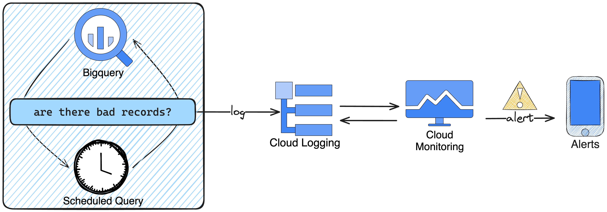

One simple way to quickly have data quality checks on top of BigQuery.

It uses Terraform to deploy scheduled queries that raise errors in case of data quality issues found, triggering GCP monitoring alerts.

An in depth explanation can be found in [the article I wrote in the subject](https://medium.com/@yefeltz/creating-scheduled-data-quality-alerts-for-bigquery-using-only-gcp-built-in-services-e05f8639b421). 



### Alerts deployed:

1. the data quality check found bad records
2. the scheduled query failed for a reason not related to the data quality check

### Prerequisites:

1. BigQuery project, datasets and tables set.
2. Notification channels already exists on the GCP account (using in this example only "Email: Yerachmiel Feltzman")

### Running locally:

Given one already can run GCP cli tool locally, authenticating in the following way is enough for simple tests:

```shell
gcloud auth application-default login
```

For a more detailed set-up,
read: https://registry.terraform.io/providers/hashicorp/google/latest/docs/guides/getting_started

### Notes:

This is an example getting-started project. It does not deal with best-practices one should consider, for example:

1. terraform backend
2. running with a GCP service account
3. configure terraform google provider with region, project, proper authentication, etc

